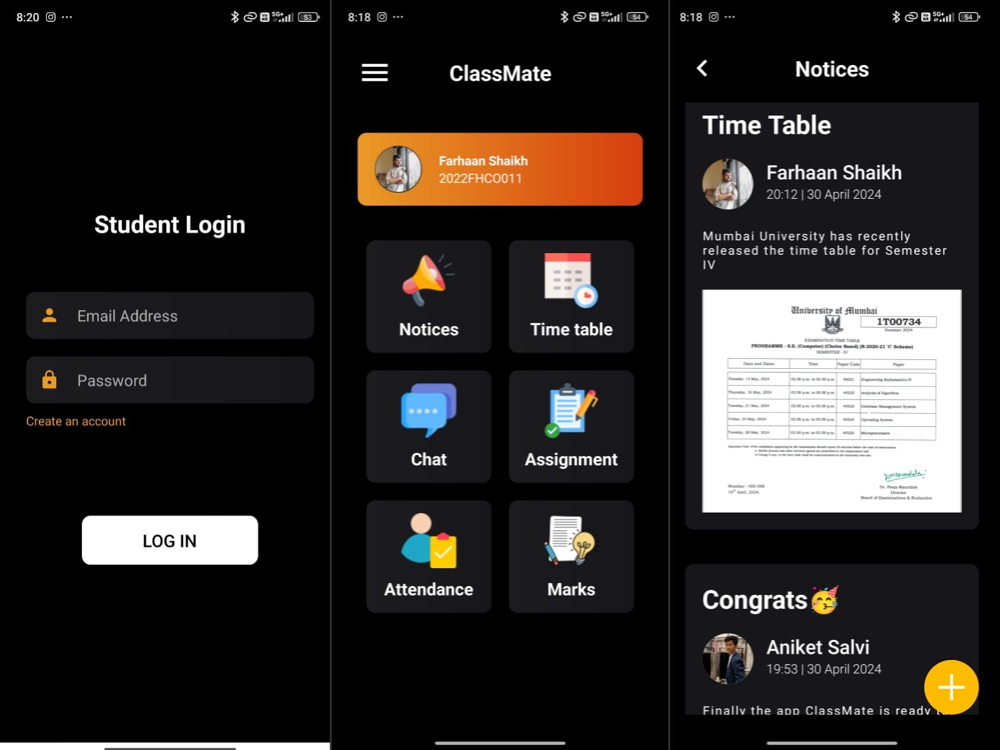
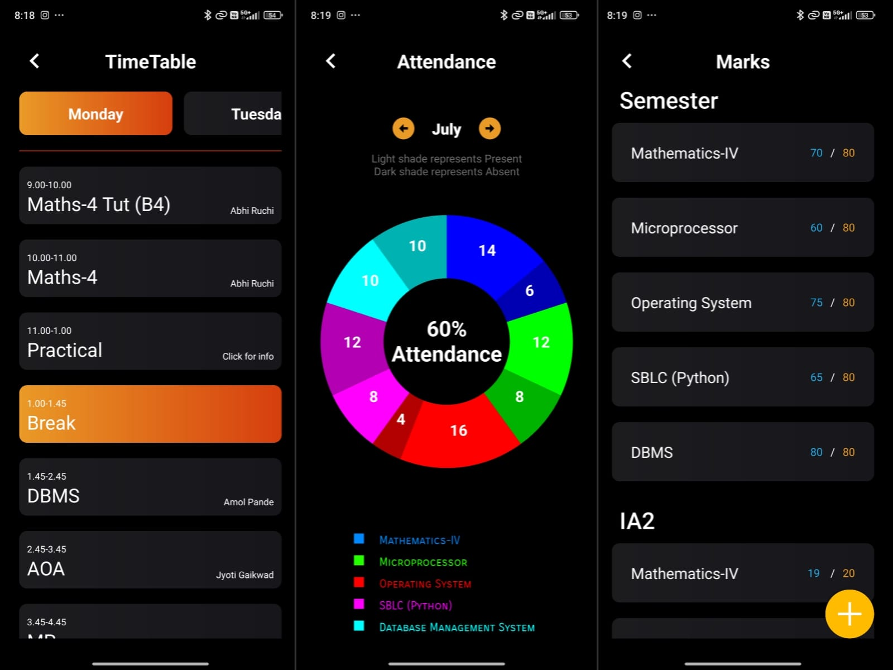

---

# 📚 Classmate: Your Ultimate Classroom Management App!

## 📖 Description

🚀 **Exciting Announcement! Introducing Classmate: Your Ultimate Classroom Management App!** 📚✨

As a student, keeping track of attendance, marks, and collaborating with classmates just got easier with Classmate! This app is designed to enhance your classroom experience, making learning more organized and collaborative than ever before.

## ✨ Key Features

- 📅 **Attendance Tracking**: Never miss a class! Keep track of your attendance effortlessly.
- 📊 **Personal Marks Management**: Students can enter and track their own grades and performance in different subjects.
- 📆 **Structured Class Schedule**: Stay organized with a structured class schedule, ensuring clarity and efficiency for all students.
- 💬 **Group Chat**: Collaborate with classmates through group chats for discussions and sharing resources.
- 👥 **Group Creation**: Admins can create new groups with a unique group code, allowing easy access for group members.
- 📢 **Important Notices**: Students can upload important notices for all users to view.
- 📄 **Assignment Uploads**: Easily upload and download assignments for seamless submission and review.
- 👤 **Student Profile**: Customize your profile with interests, society memberships, and more.

## 🚀 Installation

1. **Clone the repository**:
    ```bash
    git clone https://github.com/FSfarhaan/Classmate.git
    ```
2. **Open the project in Android Studio**:
    - Open Android Studio
    - Click on `File -> Open`
    - Select the cloned repository folder

3. **Build and Run the app**:
    - Connect your Android device or start an emulator
    - Click on the `Run` button in Android Studio

## 🛠️ Usage

1. **Tracking Attendance**:
    - Open the app and navigate to the attendance section.
    - Mark your attendance for each class.

2. **Managing Marks**:
    - Go to the marks section.
    - Enter your grades and track your performance.

3. **Using Group Chat**:
    - Join a group chat for your class or subject.
    - Collaborate and share resources with your classmates.

4. **Uploading Assignments**:
    - Go to the assignments section.
    - Upload your assignments and download the submissions.

## 🧩 Code Overview

### Main Components

- **MainActivity**: The main activity that displays the dashboard and navigation.
- **AttendanceActivity**: The activity used to track attendance.
- **MarksActivity**: The activity used to manage marks.
- **ChatActivity**: The activity for group chats.
- **AssignmentActivity**: The activity for uploading and viewing assignments.
- **DbHelper**: A helper class for managing SQLite database operations.

### Database

- **Firebase Realtime Database**: Used for real-time data management.
- **Firebase Storage**: Used for storing uploaded assignments and profile images.
- **SQLite**: Used for local data storage.
- **DbHelper.java**: Manages database creation, version management, and CRUD operations.

## 🔧 Tech Stack

- Developed in Android Java
- Utilizes Firebase Realtime Database and Storage for seamless data management
- SQLite for local data storage
- Integrates libraries like Picasso for image loading and MPAndroidChart for data visualization

Download now and elevate your academic journey with Classmate! 🎓✨

## 👥 Team Flash

This incredible app is a collaborative effort by Team Flash for their 2nd year Mini project 1-A and 1-B Combined, consisting of talented developers:
- Farhaan Shaikh 
- Aniket Salvi 
- Shravani Sawant 
- Harshika Sangam 

## 🤝 Contributing

Contributions are welcome! Please create an issue or submit a pull request with your improvements.

## 📸 Screenshots

<!-- Add screenshots of your app here. Example: -->



## 📬 Contact

If you have any questions or suggestions, feel free to contact me at [farhaan8d@gmail.com](mailto:farhaan8d@gmail.com) or connect with me on [LinkedIn](https://www.linkedin.com/in/farhaan-shaikh-422301252/).

---
